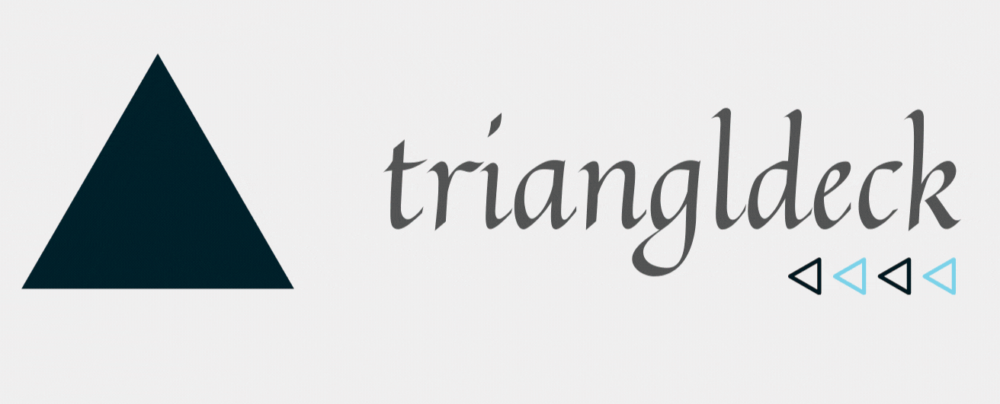
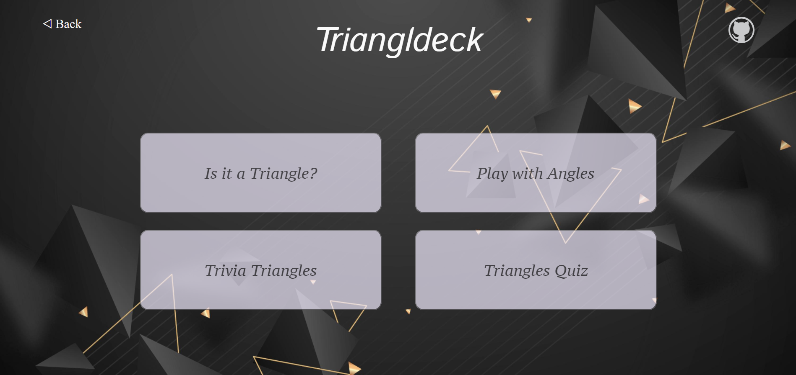
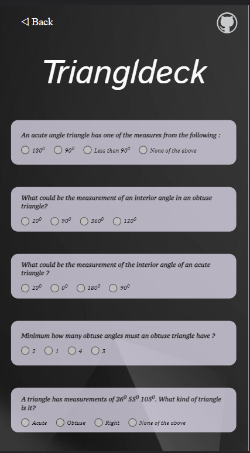

    

## ✨ About 

<b>Triangldeck 🔺</b> is the goto place to learn and practice the problems based on triangle. With triangldeck, you can find whether the angles given by user form a triangle, calculate areas, find hypotenuse, quizzes and lot more. 

## 😉 **Glimpses**

&nbsp; &nbsp; &nbsp; &nbsp; 

👉 Play with [Triangldeck](https://dcs-triangldeck.netlify.app/)

## 🎆 **Features**

- Check if angles form a triangle.
- Two sides are given, calculate third side.
- Find Hypotenuse
- Play with Area
- Quiz

## 💻 **Built with**

